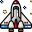
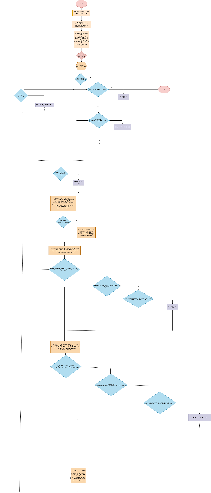

# bimestral_1

## Explicaciòn del programa y/o juego

### while not PARAR_JUEGO
- Controla el flujo del juego 

# Nave espacial esquiva planetas.

- Este es un juego de esquivar planetas con una nave espacial. En donde nuestro unico objetivo es esquivar las ordas de planetas.

- Usamos la libreria ```pygame```en donde creamos el juego para la creacion de este.


# Codigo


### Librerias
* **`import pygame`**: Importamos pygame 
* **`from random import randint`**: añado esta funcion   `randint` De este mòdulo `random` 
para sacar numeros al azar.

### Resolucion, y el start de pygame
* **`pygame.init()`**: Llamar a pygame.
* **`ANCHURA_VENTANA = 600`**, **`ALTURA_VENTANA = 600`**: Define las dimensiones de la ventana del juego.


### Color y pantalla 

En el codigo: ```COLOR_FONDO = (255, 255, 250)``` usamos esto para poner los colores.

- Luego con las variables sacamos un como una proyeccion: ```PANTALLA = pygame.display.set_mode((ALTURA_VENTANA, ANCHURA_VENTANA))```

### Un condiciòn bool 

Hacemos que para el juego sea falso con ```PARA_JUEGO = false```

### Variables del planeta

- Usamos ```randint``` para generar un nùmero random en el eje x quedando asi: ```XX_PLANETA = randint(30, 130)```
- Tamaño en el eje x del planeta: ```YY_PLANETA = 20```

- Calculamos su altura y anchura con ```ALTURA_PLANETA = 111
ANCHURA_PLANETA = 80```

- Calculamos la distancia de los planeta con esto: ```XX_ENTRE_PLANETAS = 350
YY_ENTRE_PLANETA = 125```

- Velocidad de planetas: ```VELOCIDAD_PLANETA = 2```

# Estadisticas o puntos 

- Usamos una variable ```puntos``` quedando finalmente asi: ```PUNTOS = 0```

# Texto en pantalla
- Usamos este linea para implementar texto , su tamaño en ect: ```MARCADOR = FUENTE.render("0 puntos", 1, (255, 0, 0))```
Con esto podemos mostrar texto, y ```(222, 0, 0)```color ect.

# Imagen

- ```Cohete``` para implementar la imagen de un cohete usamos esto: ```IMG_COHETE = pygame.image.load("img/COHETE.png")``` dando a esto ```IMG_COHETE``` siendo este la variable ```pygame.image.load("img/COHETE.png")``` usamos esto para cargar una imagen obiviamente poniendo bien la ruta del archivo.

- Lo mismo con lo del cohete, usamos esto para implementar los 2 planetas. Con su ruta de archivo.
``` 
IMG_PLANETA_IZQUIERDO = pygame.image.load("img/PLANETA.png")
IMG_PLANETA_DERECHO = pygame.image.load("img/PLANETA.png")
```

# Titulo 

- Para asignar un titulo en la ventana del juego, sea hace con esto ```pygame.display.set_caption("PRIMER JUEGO")```, se usa para implementar un titulo al juego.


### While 

El while es por decirlo asi: simplemente usamos ```while not Para_juego```para hacer un bucle que no pare el juego.

### For

- lo usamos para hacer el for para que nos devuelva estas condicones ``` recorre la lista de eventos que se han producido y que están almacenados en la cola de eventos. ```

### condicionales 

```
        if event.type == pygame.KEYDOWN:
            if event.key == pygame.K_ESCAPE:
                PARAR_JUEGO = True
            if event.key == pygame.K_RIGHT:
                MOVIMIENTO_XX_COHETE = 4
        elif event.type == pygame.KEYUP:
            MOVIMIENTO_XX_COHETE = -4

        if XX_COHETE < -10 or XX_COHETE > ALTURA_VENTANA:
            PARAR_JUEGO = True
```

- Usamos estas condicionales, para hacer que la nave se mueva. Arriba, abajo, a los lados.


# Dibujado 

```PANTALLA.fill(COLOR_FONDO)

    PANTALLA.blit(IMG_PLANETA_IZQUIERDO, (XX_PLANETA, YY_PLANETA))
    PANTALLA.blit(IMG_PLANETA_DERECHO, (XX_PLANETA + XX_ENTRE_PLANETAS, YY_PLANETA + YY_ENTRE_PLANETA))
```
- Usamos esto para dibujar en pantalla.

# Hacer que los planetas bajen en la izquierda

``` YY_PLANETA = YY_PLANETA + VELOCIDAD_PLANETAS``` Hacemos que los planetas bajen en el ***Y***


```
if PUNTO_INFERIOR_DERECHO_PRIMER_PLANETA_X > XX_COHETE:
        if PUNTO_INFERIOR_DERECHO_PRIMER_PLANETA_Y > YY_COHETE:
            if PUNTO_INFERIOR_DERECHO_PRIMER_PLANETA_Y < YY_COHETE + ANCHURA_COHETE:
                PARAR_JUEGO = True
```

***if PUNTO_INFERIOR_DERECHO_PRIMER_PLANETA_X > XX_COHETE:***
Compara la coordenada ***X*** del punto denominado ```PUNTO_INFERIOR_DERECHO_PRIMER_PLANETA``` con la coordenada ***X*** de un cohete ```(representado por XX_COHETE).``` Si la coordenada ***X*** del planeta es mayor que la del cohete, pasa al siguiente paso.

***if PUNTO_INFERIOR_DERECHO_PRIMER_PLANETA_Y > YY_COHETE:***
Compara la coordenada Y del punto denominado ```PUNTO_INFERIOR_DERECHO_PRIMER_PLANETA``` con la coordenada Y del cohete (representada por YY_COHETE). Si la coordenada ***Y*** del planeta es mayor que la del cohete, pasa al siguiente paso.

***if PUNTO_INFERIOR_DERECHO_PRIMER_PLANETA_Y < YY_COHETE + ANCHURA_COHETE:***
Compara la coordenada Y del planeta con la suma de la coordenada Y del cohete y la anchura del cohete ```(ANCHURA_COHETE).``` Si la coordenada ***Y*** del planeta es menor que esta suma, pasa al siguiente paso.

***PARAR_JUEGO = True***
Si todas las condiciones anteriores se cumplen, se asigna el valor True a la variable ***PARAR_JUEGO***, lo que sugiere que el juego debe detenerse en ese momento.

### Hacer que los planetas bajen, en la derecha

```
PUNTO_INFERIOR_IZQUIERDO_SEGUNDO_PLANETA_X = XX_PLANETA + XX_ENTRE_PLANETAS
    PUNTO_INFERIOR_IZQUIERDO_SEGUNDO_PLANETA_Y = YY_PLANETA + \
        YY_ENTRE_PLANETA + ANCHURA_PLANETA
```

- Lo mismo que en el punto ```Hacer los planetas que bajen a la izquierda``` hace que el objeto planetas que esta en la izquierda baje en posicion ***Y***.

```
if XX_COHETE + ALTURA_COHETE > PUNTO_INFERIOR_IZQUIERDO_SEGUNDO_PLANETA_X:
        if XX_COHETE < PUNTO_INFERIOR_IZQUIERDO_SEGUNDO_PLANETA_Y:
            if XX_COHETE + ANCHURA_COHETE > PUNTO_INFERIOR_IZQUIERDO_SEGUNDO_PLANETA_Y:
                PARAR_JUEGO = True
```
### Lo mismo que anteriormente (En hacer que los planetas bajen a la izquierda) Ahora en la derecha

- Si el otro planeta, que queda a la izquierda rompe con todas las condicones entonces. Termina el juego.


### Hacer que el cohete gire en la direccion,  ***X***.

Con ```    XX_COHETE = XX_COHETE + MOVIMIENTO_XX_COHETE ```, Hacemos que la variable ***XX_COHETE***. Entonces hace que el cohete se mueve de forma horizontal incrementando la variable. 

### Dibujar un elemento y ponerlo en la cordenada.

```PANTALLA.blit(MARCADOR, (20, 580))```en este linea hacemos que el objeto ***MARCADOR***  aparezca en la cordenada **(20, 580)** ese es la cordenada para que aparezca dicho objeto. Tambien llamamos a la funcion ```Pantalla.blit```

### Agregar elemento cohete...

``PANTALLA.blit(IMG_COHETE, (XX_COHETE, YY_COHETE))`` Con este elemeto hacemos que agregue la imagen de cohete. Es lo mismo que en el punto anteriormente explicado.



### Actualizar pantalla del juego
    pygame.display.update()

- En pygame usamos eso, para actualizar la pantalla del juego. y asi 

poder seguir editando. 


# Objetos.


# Diagrama


